<div align="center">

# Automatic Term Extraction from Scratch

**Keyword extractors tell you what a document is about.<br>Term extractors tell you what a domain is made of.**

Building the C-value algorithm and a complete ATE pipeline in pure Python —<br>
with error analysis, benchmark context, and a decision guide.

[](https://medium.com/@huseyinceniik/automatic-term-extraction-the-research-field-behind-your-keyword-extractor-f212338829b8)
[](https://www.kaggle.com/code/huseyincenik/automatic-term-extraction)
[](https://github.com/huseyincenik/automatic_term_extraction)

[](https://www.python.org/)
[](automatic-term-extraction-from-scratch.ipynb)
[](LICENSE)

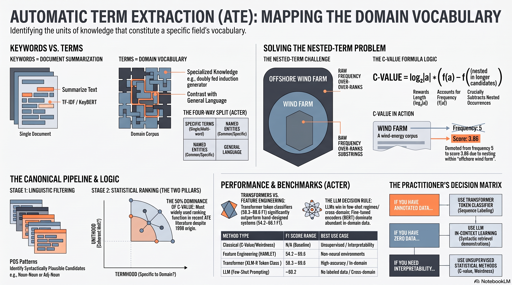

</div>

---

## Table of Contents

- [What this is](#what-this-is)
- [Terms are not keywords](#terms-are-not-keywords)
- [The pipeline](#the-pipeline)
- [Quick start](#quick-start)
- [The problem C-value solves](#the-problem-c-value-solves)
- [Results](#results)
- [What goes wrong, and why it matters](#what-goes-wrong-and-why-it-matters)
- [Choosing a method](#choosing-a-method)
- [How the field got here](#how-the-field-got-here)
- [Repository layout](#repository-layout)
- [Figures](#figures)
- [References](#references)

---

## What this is

**Automatic Term Extraction (ATE)** is an NLP task that identifies domain-specific
terminology in specialised corpora. It has a formal definition, a manually annotated
multilingual benchmark, three survey papers published between 2023 and 2026, and an active
research frontier — and almost no practical coverage outside the academic literature.

This repository is the code behind an article that tries to close that gap. It contains:

| | |
|---|---|
| 📓 **A runnable notebook** | The full pipeline built step by step, executed with outputs |
| 🐍 **A dependency-free implementation** | ~150 lines of standard-library Python, inside the notebook |
| 📊 **The article's figures** | All 20, regenerable from source |
| 📝 **The article itself** | [on Medium](https://medium.com/@huseyinceniik/automatic-term-extraction-the-research-field-behind-your-keyword-extractor-f212338829b8) |

> **Start here:** [**Run the notebook on Kaggle**](https://www.kaggle.com/code/huseyincenik/automatic-term-extraction) —
> nothing to install, nothing to download.

---

## Terms are not keywords

The distinction is not pedantic; it determines the entire system design.

| Dimension | Keyword extraction | Automatic term extraction |
|---|---|---|
| **Question answered** | What is this document about? | What vocabulary defines this domain? |
| **Unit of analysis** | A single document | A domain corpus |
| **Candidate generation** | All n-grams, or stopword-delimited chunks | POS-constrained patterns |
| **Ranking signal** | TF-IDF, TextRank, YAKE, KeyBERT | C-value, weirdness, neural token classification |
| **Reference corpus** | Implicit — the same collection | Explicit general-language contrast corpus |
| **Nested terms** | Not modelled | **Central concern** |
| **Typical output** | 5–10 keywords per document | A ranked termbase for the domain |
| **Evaluation** | Largely qualitative | Gold standard; precision, recall, F1 |

A TF-IDF pipeline over a unigram vocabulary cannot, in principle, emit
*doubly fed induction generator* as a single unit. Neither can it model the relationship
between *wind farm* and *offshore wind farm*.

---

## The pipeline

Nearly all classical ATE systems share a two-stage architecture: a **linguistic filter**
proposes syntactically plausible candidates, and a **statistical ranker** scores them.
A 2026 systematic review found this hybrid design in 50% of 113 papers surveyed.


The ranking stage measures two **distinct** properties:

- **Unithood** — is this sequence of words a coherent lexical unit, or an accidental collocation?
- **Termhood** — assuming it is a unit, is it specific to this domain, or general language?

Systems that measure only one fail characteristically: unithood alone accepts frequent but
general phrases; termhood alone accepts fragments of terms.

---

## Quick start

The fastest path is the notebook — it needs nothing installed and nothing downloaded:

**[▶ Open it on Kaggle](https://www.kaggle.com/code/huseyincenik/automatic-term-extraction)**

Or run it locally:

```bash
git clone https://github.com/huseyincenik/automatic_term_extraction.git
cd automatic_term_extraction
jupyter notebook automatic-term-extraction-from-scratch.ipynb
```

Sections 3–8 of the notebook depend on nothing outside the Python standard library.
Running them end to end produces:

```
=== Multi-word terms only (have_single_word=False) ===
 #  TERM                               FREQ   C-VALUE    WEIRD  TERMHOOD
------------------------------------------------------------------------
 1  wind turbine                          6      4.92     10.7     12.10
 2  wind farm                             5      3.86      8.5      8.67
 3  wind speed                            5      4.00      5.8      7.66
 4  offshore wind                         3      1.83      7.6      3.94
 5  offshore wind farm                    2      1.58      7.3      3.36
```

Using the pipeline on your own text — `extract_terms` is defined in the notebook
(and also in `figures/generate_figures.py`, which inlines the whole pipeline):

```python
terms = extract_terms(
    technical_corpus=my_domain_text,
    general_corpus=my_background_text,
    top_n=25,
    min_freq=2,
    have_single_word=False,   # multi-word terms only
)

for t in terms:
    print(f"{t['termhood']:6.2f}  {t['term']}")
```

To regenerate every figure in the article (needs `matplotlib` and `numpy`):

```bash
pip install -r requirements.txt
python figures/generate_figures.py    # all 20 figures, ~10 seconds
```

`generate_figures.py` is **self-contained**: it carries its own copy of the pipeline, so
the figures and the notebook are computed by the same code.

---

## The problem C-value solves

Raw frequency systematically over-ranks substrings. If *offshore wind farm* occurs twice,
then *wind farm* necessarily occurs at least twice as well — and a frequency-ranked list
credits the shorter string with occurrences it never independently earned.
Frantzi et al. (2000) named these **nested terms**.

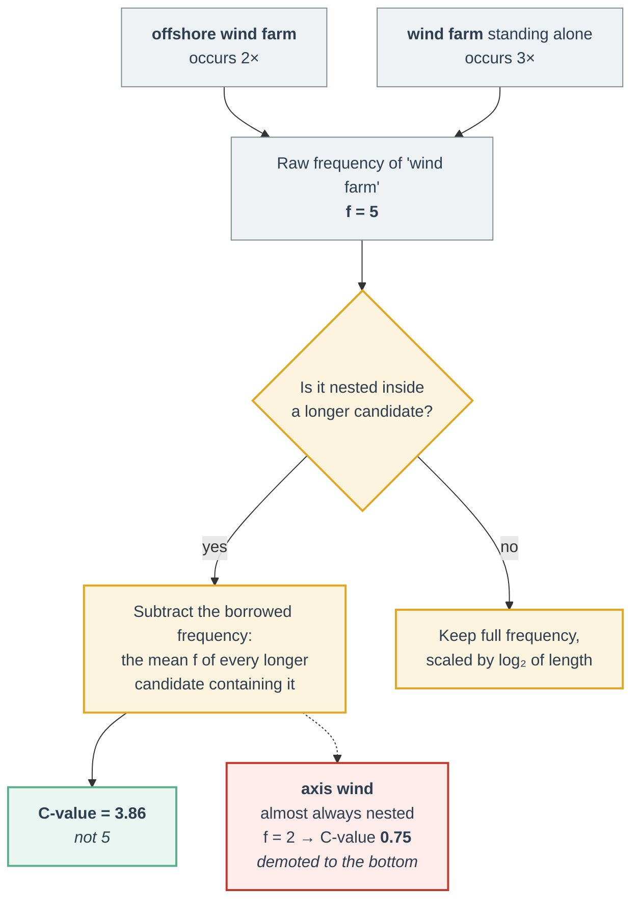

The formula:

$$
\text{C-value}(a) =
\begin{cases}
\log_2 |a| \cdot f(a) & \text{if } a \text{ is not nested} \\[8pt]
\log_2 |a| \cdot \left( f(a) - \dfrac{1}{P(T_a)} \sum_{b \in T_a} f(b) \right) & \text{otherwise}
\end{cases}
$$

where $|a|$ is the length of candidate $a$ in words, $f(a)$ its corpus frequency, $T_a$ the
set of longer candidates containing $a$, and $P(T_a)$ the size of that set.

Termhood comes from **weirdness**, contrasting the technical corpus against general language:

$$
\text{weirdness}(w) = \frac{f_{\text{tech}}(w) \,/\, N_{\text{tech}}}{f_{\text{gen}}(w) \,/\, N_{\text{gen}}}
$$

and the two are combined so that weirdness *re-ranks* rather than dominates:

$$
\text{termhood}(a) = \text{C-value}(a) \cdot \log\!\big(1 + \text{weirdness}(a)\big)
$$

---

## Results

Running the pipeline on a wind-energy corpus — deliberately, because **wind energy is one
of the four ACTER benchmark domains**:

| Rank | Term | f(a) | C-value | Weirdness | Termhood | Assessment |
|---:|---|---:|---:|---:|---:|---|
| 1 | wind turbine | 6 | 4.92 | 10.7 | 12.10 | ✅ valid |
| 2 | wind farm | 5 | 3.86 | 8.5 | 8.67 | ✅ valid |
| 3 | wind speed | 5 | 4.00 | 5.8 | 7.66 | ✅ valid |
| 4 | offshore wind | 3 | 1.83 | 7.6 | 3.94 | ⚠️ fragment of *offshore wind farm* |
| 5 | offshore wind farm | 2 | 1.58 | 7.3 | 3.36 | ✅ valid |
| 6 | axis wind turbine | 2 | 1.58 | 6.8 | 3.26 | ⚠️ should be *horizontal axis wind turbine* |
| 7 | electrical energy | 2 | 2.00 | 3.2 | 2.85 | ✅ valid |
| 8 | power output | 3 | 2.00 | 2.4 | 2.46 | ✅ valid |
| 9 | rotor blades | 2 | 1.00 | 4.7 | 1.75 | ✅ valid |
| 10 | axis wind | 2 | 0.75 | 5.4 | 1.39 | ❌ spurious |

**Precision@10 = 70%**, with no training data, no annotation, and nothing larger than a
`Counter`.

> ⚠️ This figure is **not** comparable to published ACTER scores. It is precision@10 on a
> 250-word toy corpus judged by one person; published systems report precision, recall and
> F1 over a fully annotated held-out domain. Treat it as a sanity check, never as a
> benchmark result.

---

## What goes wrong, and why it matters

The failures are more instructive than the successes.

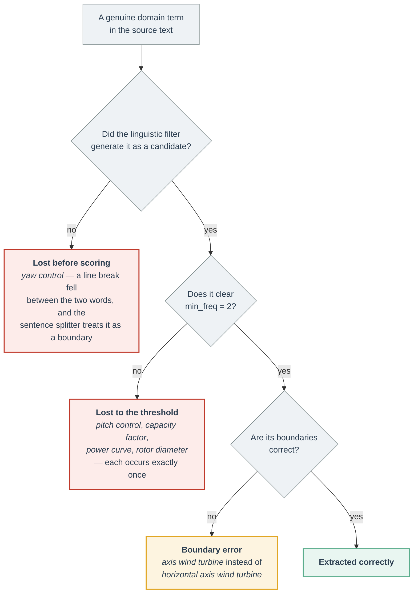

Three lessons, each of which anticipates a finding in the literature:

1. **Frequency thresholding destroys recall.** Candidates fall from 98 at `min_freq=1` to
   33 at `min_freq=2`. Frequency-based methods are *structurally* incapable of recovering
   rare terms — which is exactly the dimension on which TermEval 2020 found systems to
   differ most sharply.

2. **A term the filter never proposes cannot be recovered by any ranker.** *Yaw control*
   is absent from the output not because it scored badly, but because a line break split
   the bigram before scoring began. The filter stage deserves as much attention as the
   algorithm — which is why production systems use a real sentence segmenter, not a regex.

3. **Boundary errors are an open research problem, not a bug here.** The 2023 survey lists
   nested terms as an open challenge for *Transformer* models: current systems "often
   predict nested shorter terms rather than complete multi-word terms." The phenomenon
   Frantzi et al. named in 1998 appeared unprompted in a 60-line implementation.

---

## Choosing a method

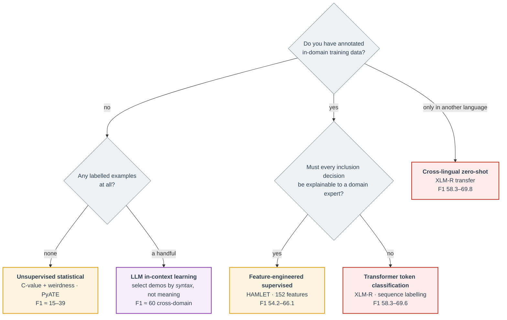

> **The decision rule in one line:** LLMs win when labelled data is scarce; fine-tuned
> encoders win when it is not. On the in-domain BCGM benchmark the gap is 53.8 vs. **88.5** F1.

Two findings worth knowing before you reach for an LLM:

- **Retrieve few-shot demonstrations by syntax, not semantics.** Chun et al. (2025) show
  semantic similarity has a *negative* correlation with F1 across domains, because words
  that are terms in one field are generic in another.
- **Syntactic retrieval works with zero term overlap.** Their demonstrations contained
  *none* of the gold terms and still performed competitively. A term's meaning does not
  transfer across domains; its shape does.

---

## How the field got here

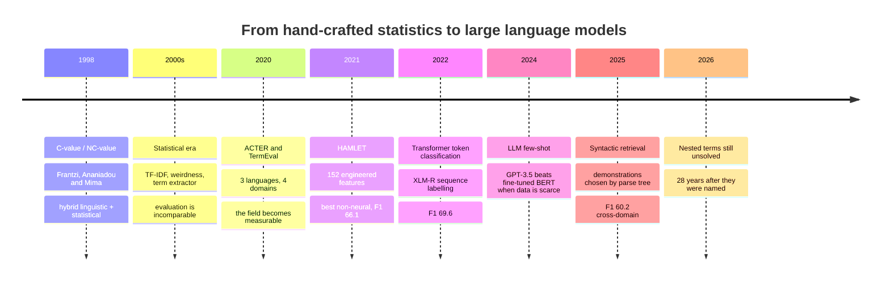

Two statistics that put this in perspective, from a systematic mapping of 113 papers
published 2015–2022:

- **C-value is used in 50%** of studies — an algorithm from 1998, still the most-used
  ranking function in its field. TF-IDF is second at 31%.
- **Hybrid designs account for 50%** of studies, purely statistical 38.2%, purely
  linguistic 11.8%.

---

## Repository layout

```
automatic_term_extraction/
├── automatic-term-extraction-from-scratch.ipynb   ← the notebook (executed, 70 cells)
├── requirements.txt                               ← only needed to regenerate figures
├── LICENSE
└── figures/
    ├── generate_figures.py     ← self-contained; regenerates all 20 figures
    ├── fig1–fig7*.png          ← charts
    ├── table1–table5*.png      ← tables
    ├── formula1–formula8*.png  ← rendered formulas
    └── Automatic_Term_Extraction_Infographic.png
```

Figures 2, 3, 4 and Table 3 are computed live from the pipeline; Figures 5, 6 and 7
reproduce published results and name their source in the caption.

---

## Figures

| | |
|---|---|
| 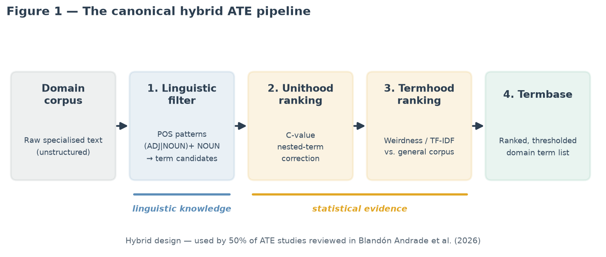 | 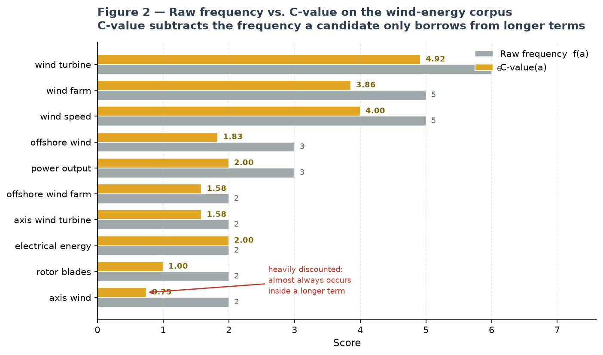 |
| **Fig. 1** — the canonical hybrid pipeline | **Fig. 2** — raw frequency vs. C-value |
| 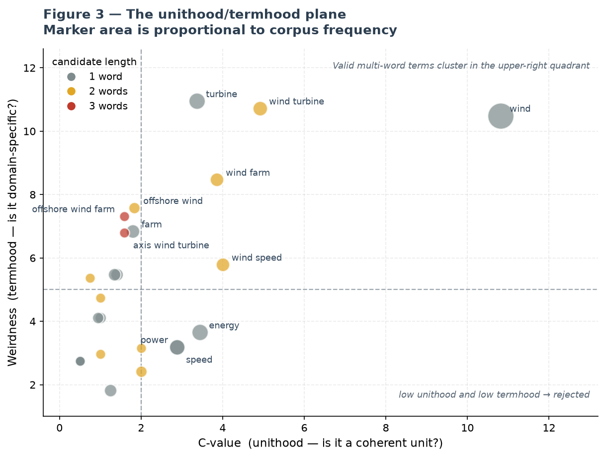 | 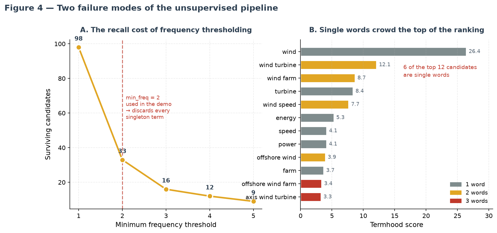 |
| **Fig. 3** — the unithood/termhood plane | **Fig. 4** — two failure modes |
| 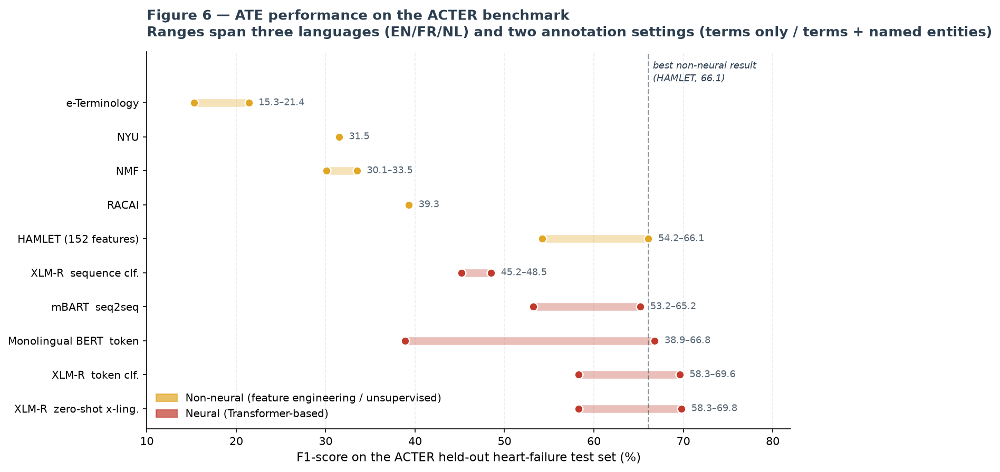 | 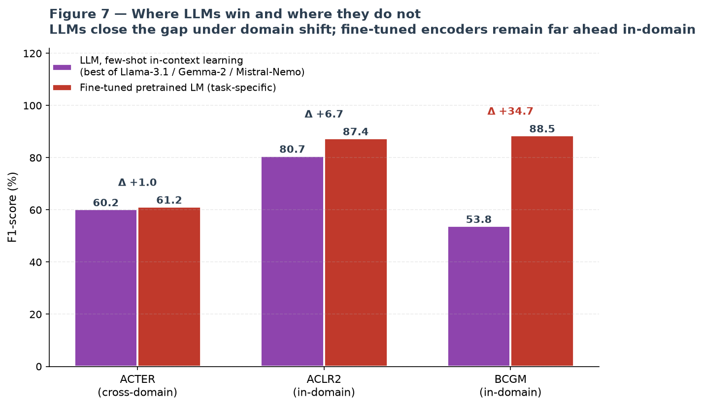 |
| **Fig. 6** — ATE performance on ACTER | **Fig. 7** — where LLMs win and where they don't |

---

## References

- **Frantzi, K., Ananiadou, S., & Mima, H.** (2000). Automatic recognition of multi-word terms:
  the C-value/NC-value method. *International Journal on Digital Libraries*, 3(2), 115–130.
  [doi:10.1007/s007999900023](https://doi.org/10.1007/s007999900023)
- **Rigouts Terryn, A., Hoste, V., & Lefever, E.** (2019). In no uncertain terms: a dataset for
  monolingual and multilingual automatic term extraction from comparable corpora.
  *Language Resources and Evaluation*, 54(2), 385–418.
  [doi:10.1007/s10579-019-09453-9](https://doi.org/10.1007/s10579-019-09453-9)
- **Rigouts Terryn, A., Hoste, V., Drouin, P., & Lefever, E.** (2020). TermEval 2020: Shared Task
  on Automatic Term Extraction Using the ACTER Dataset. *COMPUTERM 2020 @ LREC*, 85–94.
  [aclanthology.org/2020.computerm-1.12](https://aclanthology.org/2020.computerm-1.12/)
- **Tran, H. T. H., Martinc, M., Caporusso, J., Doucet, A., & Pollak, S.** (2023). The Recent
  Advances in Automatic Term Extraction: A survey.
  [arXiv:2301.06767](https://arxiv.org/abs/2301.06767)
- **Banerjee, S., Chakravarthi, B. R., & McCrae, J. P.** (2024). Large Language Models for
  Few-Shot Automatic Term Extraction. *NLDB 2024*, LNCS 14762.
  [doi:10.1007/978-3-031-70239-6_10](https://doi.org/10.1007/978-3-031-70239-6_10)
- **Chun, Y., Kim, M., Kim, D., Park, C., & Lim, H.** (2025). Enhancing Automatic Term
  Extraction with Large Language Models via Syntactic Retrieval. *Findings of ACL 2025*.
  [aclanthology.org/2025.findings-acl.516](https://aclanthology.org/2025.findings-acl.516/)
- **Xu, K., Feng, Y., Li, Q., Dong, Z., & Wei, J.** (2025). Survey on terminology extraction
  from texts. *Journal of Big Data*.
  [doi:10.1186/s40537-025-01077-x](https://doi.org/10.1186/s40537-025-01077-x)
- **Blandón Andrade, J. C., et al.** (2026). Approaches, Tools, Algorithms, and Methods for
  Automatic Term Extraction: A Systematic Literature Mapping.
  [doi:10.1177/18758967251392652](https://doi.org/10.1177/18758967251392652)
- **Tran, H. T. H., et al.** (2026). Recent Advances in Automatic Term Extraction:
  A Comprehensive Survey. *ACM Computing Surveys*.
  [doi:10.1145/3787584](https://doi.org/10.1145/3787584)

**Dataset** — ACTER: [github.com/AylaRT/ACTER](https://github.com/AylaRT/ACTER) (CC BY-NC-SA 4.0)
**Library** — PyATE: [github.com/kevinlu1248/pyate](https://github.com/kevinlu1248/pyate)

---

## Licence

Code is released under the [MIT Licence](LICENSE). The cited papers and the ACTER dataset
remain under their own terms.

---

<div align="center">

**[📖 Read the article](https://medium.com/@huseyinceniik/automatic-term-extraction-the-research-field-behind-your-keyword-extractor-f212338829b8)** ·
**[📓 Run the notebook](https://www.kaggle.com/code/huseyincenik/automatic-term-extraction)** ·
**[💼 LinkedIn](https://www.linkedin.com/in/huseyincenik/)**

If this was useful, a ⭐ helps other people find it.

</div>
